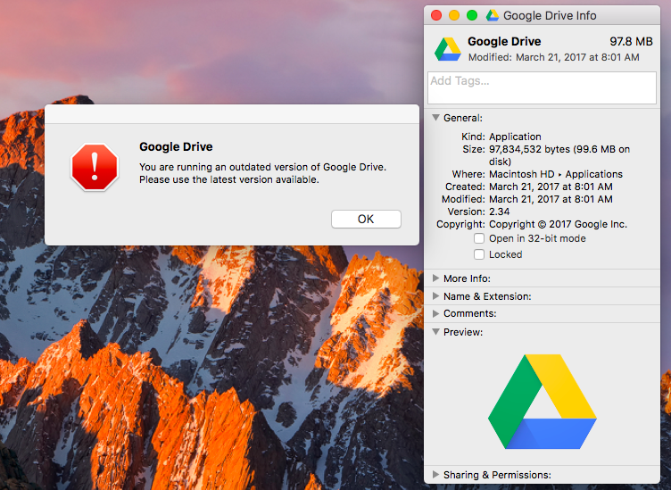

Since Google is now forcing all new installs to use the new Backup and Sync client it would be helpful if you created a news article on the [bConnected site](https://bconnected.berkeley.edu/) that tells people how to download and install the old Google Drive sync via this link: https://www.google.com/drive/download/client/

The official documentation: https://berkeley.service-now.com/kb_view.do?sysparm_article=KB0011902
As of Fri Aug 4, 2017 notes: **[Backup and Sync from Google] service has been temporarily disabled for bConnected accounts. We will update this article when the application is made available.**

And how to clear their app data cache (see similar solution for a different gdrive issue):

For Macs:
 - Select “Quit Google Drive Backup and Sync” from the sync client menu.
 - Uninstall the "Google Drive Backup and Sync" client
 - In Finder select “Go” --> “Go to Folder...“.
 - Enter this, exactly: ~/Library/Application Support/Google/
 - Delete the folder titled “Drive”.
 - Start the old the desktop sync client called "Google Drive".

For PCs:
 - Select “Quit Google Drive Backup and Sync” from the sync client menu.
 - Uninstall the "Google Drive Backup and Sync" client
 - Select “Choose File”, and navigate to: %UserProfile%\AppData\Local\Google\
 - Delete the folder titled “Drive”.
 - Start the old the desktop sync client called "Google Drive".
 

